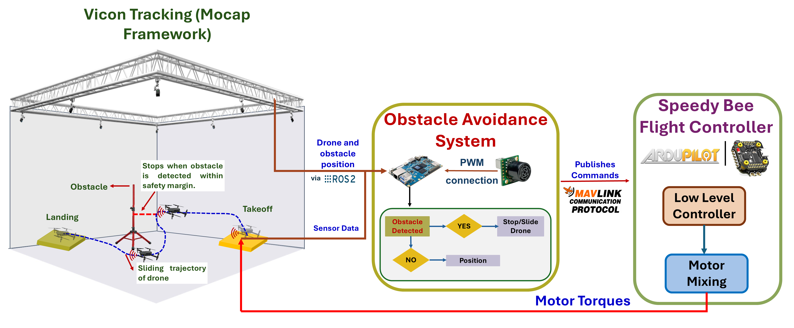
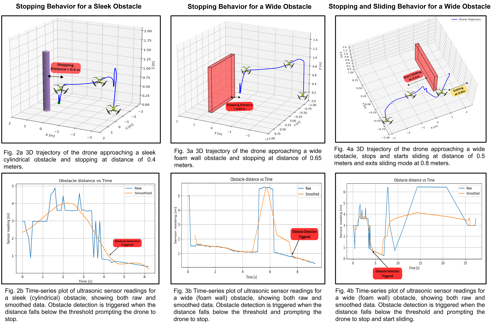

# 🚁 Obstacle Avoidance System for ArduPilot (Ultrasonic-Based)

This repository presents a **low-cost, resource-efficient obstacle avoidance system** for UAVs using **ultrasonic sensors**, integrated with **ArduPilot via MAVROS and ROS2**.

The system demonstrates real-time obstacle detection and avoidance behaviors:
- 🛑 **Stopping**
- ↔️ **Sliding (reactive avoidance)**

---

## 📌 Overview

Autonomous drone navigation in cluttered environments typically relies on **vision-based systems**, which require high computational resources.

This project explores a lightweight alternative:

> ❓ *How can we achieve reliable obstacle avoidance without using cameras?*

We propose an **ultrasonic-based solution** that enables:
- Real-time obstacle detection
- Low computational cost
- Easy integration with embedded systems

---

## 🧠 System Architecture

### Workflow

1. **VICON (MoCap)** provides drone and obstacle positions via ROS2  
2. **Ultrasonic sensor** detects nearby obstacles  
3. **Onboard controller (ROS2 node)** processes sensor data  
4. Behavior is triggered:
   - Stop  
   - Slide  
5. Commands are sent via **MAVLink → ArduPilot (SpeedyBee F405)**  

---

## 🎯 Objectives

- Achieve reliable obstacle detection and avoidance  
- Implement real-time control using low-cost sensors  
- Integrate ultrasonic sensing with:
  - Flight controller  
  - Onboard computer (Orange Pi)  
- Validate performance through real flight experiments  

---

## ⚙️ Methodology

### 🔧 Drone Setup
- 5-inch custom-built drone  
- Tuned using **Mission Planner**

### 📡 Sensor Integration
- **XL-MaxSonar-EZ3 ultrasonic sensor**
- Range: up to 7 m  
- PWM-based signal output  
- Wide detection cone → robust to noise  

### 📍 Sensor Placement
- Mounted ~60 mm below drone center  
- Improves detection reliability  

### 📊 Data Processing
- Moving average filter (buffer size = 10)  
- Reduces sensor noise and fluctuations  

---

## 🧪 Experiments

Experiments were conducted in an indoor environment using ROS2 and motion capture.

### Test Scenarios
- Cylindrical obstacle (sleek)  
- Wide foam wall  

### Behaviors Tested
- Stopping behavior  
- Sliding avoidance behavior  

### Safety Margin
- Detection threshold: **0.5 m**

---

## 📈 Results

### Key Observations

- ✅ Successful obstacle detection using ultrasonic sensors  
- ✅ Average stopping error: **±0.15 m**  
- ✅ Higher success rate for wider obstacles  
- ⚠️ Lower detection reliability for narrow objects  

### Performance Summary

| Obstacle Type | Success Rate | Std Dev (m) |
|--------------|-------------|-------------|
| Wide (Foam Wall) | 80% | ±0.20 |
| Sleek (Cylinder) | 60% | ±0.12 |

---

## 🎥 Results (Videos)

| Experiment | Description |
|----------|------------|
| `Experiment_1_with_ultrasonic_sensor.mp4` | Stopping behavior |
| `Experiment_2_with_ultrasonic_sensor.mp4` | Sliding behavior |

---

## 📂 Repository Structure
